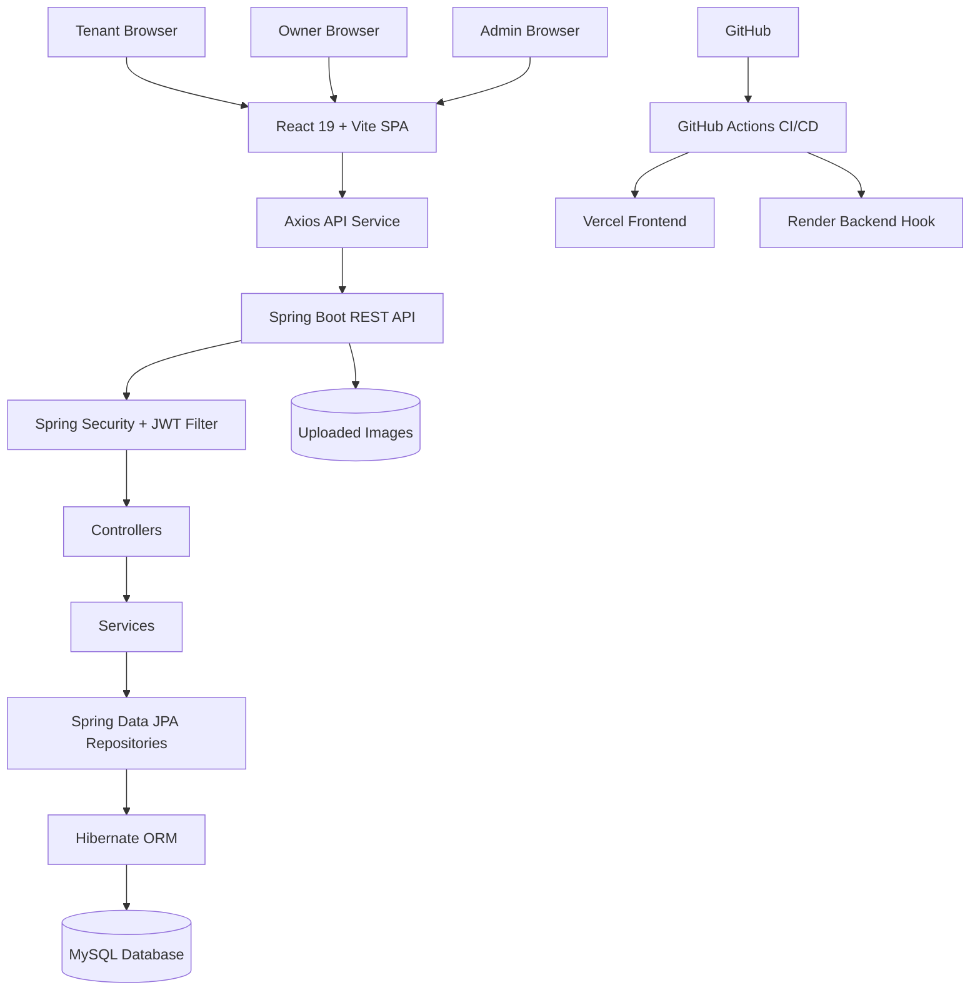
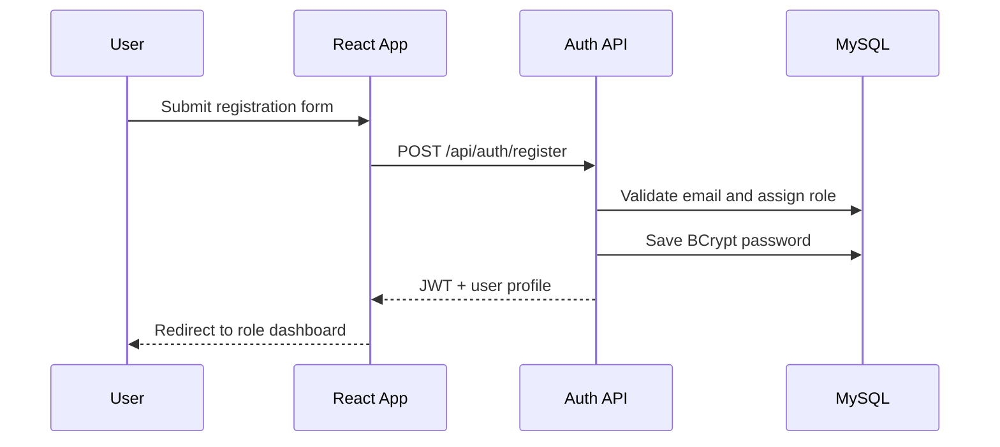
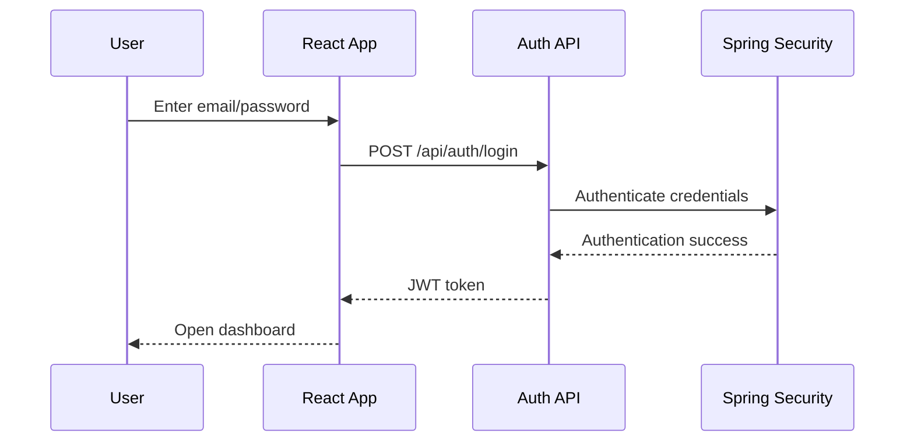
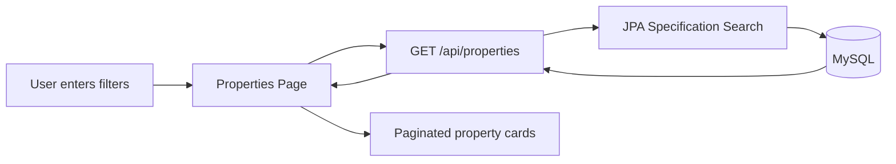
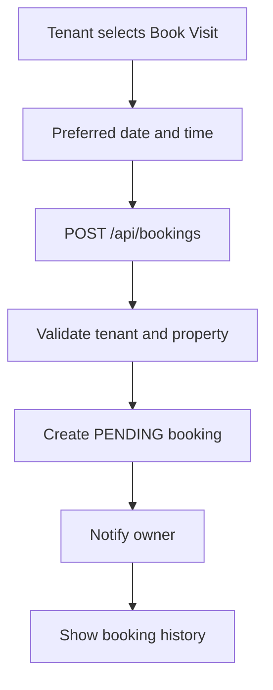
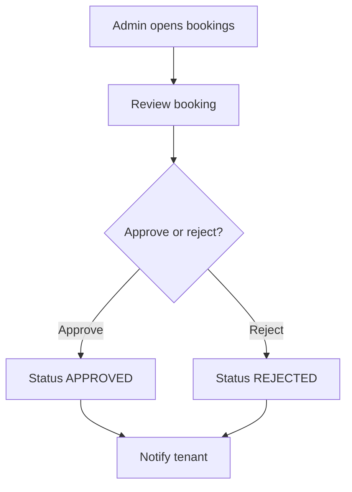
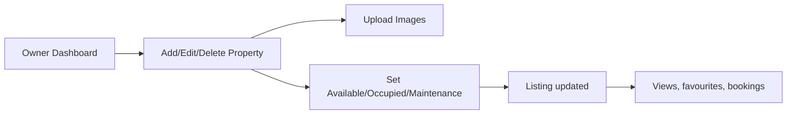
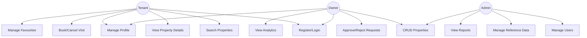
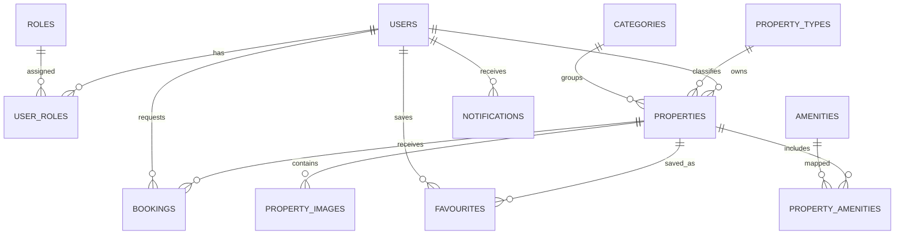

# Property Rental Marketplace - Technical Documentation

## 1. Cover Page

| Item | Details |
| --- | --- |
| Project Name | Property Rental Marketplace |
| Author | Ramcharan Elakatti |
| Date | July 29, 2026 |
| Version | 1.0.0 |
| Technology Stack | React 19, Vite, Bootstrap 5, Java 21, Spring Boot 3, Spring Security, JWT, Spring Data JPA, MySQL, Docker, GitHub Actions, Vercel, Render |
| Repository Link | https://github.com/RamcharanElakatti/Rental_Property_Platform.git |
| Deployment Links | Frontend: `<Vercel URL>`; Backend: `<Render URL>` |

## 2. Table Of Contents

1. Cover Page
2. Table Of Contents
3. Executive Summary
4. Business Requirements
5. Functional Requirements
6. Non Functional Requirements
7. Software Architecture
8. System Workflow
9. User Roles
10. Use Case Diagram
11. Database Design
12. API Documentation
13. Security Design
14. Frontend Design
15. Backend Design
16. Project Folder Structure
17. UI Screens
18. Installation Guide
19. Deployment Guide
20. CI/CD Pipeline
21. Testing Strategy
22. Performance Optimisation
23. Error Handling
24. Future Enhancements
25. Challenges And Solutions
26. AI Usage
27. Conclusion
28. Appendix

## 3. Executive Summary

Property Rental Marketplace is a full-stack rental platform that helps tenants discover rental properties, book visits, save favourites, and receive notifications. Property owners can manage listings and approve or reject visit requests. Administrators can monitor the entire platform using dashboards, reports, user controls, and reference-data management.

The application solves fragmented rental discovery and manual visit coordination by providing a secure, role-based, centralized workflow. It targets tenants, property owners, and platform administrators. Its business value comes from faster property discovery, structured booking management, stronger operational visibility, and reusable architecture suitable for production extension.

Key technologies include React 19, Vite, Spring Boot 3, Spring Security, JWT, MySQL, Docker, GitHub Actions, Vercel, and Render.

## 4. Business Requirements

| Area | Requirement |
| --- | --- |
| Current Problems | Rental data is scattered, visits are manually coordinated, owners lack analytics, and admins need centralized control. |
| Objectives | Provide authenticated role-based workflows for search, booking, property management, reporting, and administration. |
| Scope | Web frontend, REST backend, MySQL schema, role-based security, dashboards, documentation, Docker, CI/CD, and deployment configuration. |
| Out Of Scope | Payments, legal lease execution, real-time chat, production email/SMS delivery, and live map provider integration. |
| Success Criteria | Users can register/login, search properties, book visits, manage listings, administer data, run locally, build in CI, and deploy frontend through Vercel. |

## 5. Functional Requirements

| Module | Functional Requirements |
| --- | --- |
| Authentication | Registration, login, forgot password, reset password, remember me, logout, JWT issuance, password encryption, role-based access. |
| Tenant | Dashboard, profile management, avatar upload, search, filters, property details, booking history, cancel visit, favourites, recently viewed, notifications. |
| Owner | Dashboard, statistics, CRUD property, status management, multiple image upload, tenant request approval/rejection, analytics. |
| Admin | Dashboard analytics, users, owners, tenants, properties, bookings, categories, property types, amenities, reports, notifications, settings. |
| Property Management | Create, update, delete, list, detail view, images, amenities, category, type, owner, status, search, pagination, sorting. |
| Booking Management | Request visit, preferred date/time, pending/approved/rejected/completed/cancelled statuses, booking history. |
| Notifications | Profile updates, booking approvals/rejections, new bookings, favourite events, unread counts, mark read. |
| Favourite Properties | Add favourite, remove favourite, list favourite properties. |
| Search And Filtering | Keyword, city, state, rent range, bedrooms, bathrooms, property type, availability, sorting, pagination. |
| Dashboard | Tenant, owner, and admin dashboards with metrics, charts, and operational tables. |
| Reports | Admin report endpoint and UI for users, properties, bookings, favourites, property statuses, and city distribution. |
| Settings | UI for security and deployment configuration visibility. |

## 6. Non Functional Requirements

| Category | Implementation |
| --- | --- |
| Performance | Pagination, indexed database columns, frontend bundle chunking, optimized API queries. |
| Security | JWT, BCrypt, protected APIs, role authorization, CORS, validation, secure exception responses. |
| Scalability | Layered backend, stateless authentication, Dockerized services, deployable frontend/backend separation. |
| Availability | Vercel frontend deployment, Render backend deployment option, Docker Compose local runtime. |
| Maintainability | DTOs, mappers, services, repositories, reusable React components, documented folder structure. |
| Usability | Responsive Bootstrap UI, dashboards, forms, tables, modals, toast notifications, dark mode. |
| Reliability | Validation, global exception handling, typed status enums, consistent API wrapper. |
| Accessibility | Semantic labels, button labels, alt text, keyboard-friendly forms and controls. |
| Responsiveness | Desktop, tablet, and mobile layouts using responsive Bootstrap grids and custom CSS. |

## 7. Software Architecture

The system uses a layered architecture. The frontend is a React SPA that communicates with the Spring Boot REST API through Axios. The backend authenticates requests with JWT, applies business logic in services, persists data through Spring Data JPA/Hibernate, and stores records in MySQL.



## 8. System Workflow

### User Registration



### Login



### Property Search



### Booking Visit



### Admin Approval



### Owner Property Management



## 9. User Roles

| Role | Permissions | Responsibilities |
| --- | --- | --- |
| Tenant | Search properties, view details, book/cancel visits, manage profile, favourites, notifications. | Discover rentals and manage visit requests. |
| Owner | Manage own properties, upload images, view requests, approve/reject bookings, view analytics. | Keep listings accurate and respond to tenant requests. |
| Admin | Manage users, properties, bookings, categories, property types, amenities, reports, settings. | Govern platform operations and maintain data quality. |

Role hierarchy: `Admin > Owner > Tenant` for operational access. Admin has platform-wide privileges, owner access is scoped to owned properties, and tenant access is scoped to personal activity.

## 10. Use Case Diagram



## 11. Database Design

| Table | Purpose |
| --- | --- |
| users | Stores account profile, encrypted password, enabled status, avatar, and password reset token. |
| roles | Stores role names: ROLE_ADMIN, ROLE_OWNER, ROLE_TENANT. |
| user_roles | Many-to-many relationship between users and roles. |
| properties | Main rental listing with rent, deposit, rooms, area, address, coordinates, owner, status, counts. |
| property_images | Multiple images per property with primary image flag. |
| bookings | Visit requests with tenant, property, preferred date/time, status, and owner note. |
| categories | Property categories such as Apartment, Villa, Studio. |
| property_types | Property types such as Residential, Commercial, Luxury, Budget. |
| amenities | Amenity master data such as WiFi, Parking, Security. |
| property_amenities | Many-to-many relationship between properties and amenities. |
| favourites | Tenant saved properties with uniqueness per tenant/property. |
| notifications | User notifications with title, message, type, read status, and timestamps. |



## 12. API Documentation

All API responses use a common wrapper:

```json
{
  "success": true,
  "message": "Operation completed",
  "data": {}
}
```

### Endpoint Summary

| Module | Method | URL | Purpose | Auth |
| --- | --- | --- | --- | --- |
| Auth | POST | `/api/auth/register` | Create tenant/owner account | No |
| Auth | POST | `/api/auth/login` | Authenticate and issue JWT | No |
| Auth | POST | `/api/auth/forgot-password` | Generate reset token | No |
| Auth | POST | `/api/auth/reset-password` | Reset password | No |
| Users | GET | `/api/users/me` | Current profile | Yes |
| Users | PUT | `/api/users/me` | Update profile | Yes |
| Users | POST | `/api/users/me/avatar` | Upload avatar | Yes |
| Properties | GET | `/api/properties` | Search/list properties | No |
| Properties | GET | `/api/properties/{id}` | Property details | No |
| Properties | POST | `/api/properties` | Create property | Owner/Admin |
| Properties | PUT | `/api/properties/{id}` | Update property | Owner/Admin |
| Properties | DELETE | `/api/properties/{id}` | Delete property | Owner/Admin |
| Properties | POST | `/api/properties/{id}/images` | Upload property images | Owner/Admin |
| Bookings | POST | `/api/bookings` | Request visit | Tenant |
| Bookings | GET | `/api/bookings/me` | Tenant booking history | Tenant |
| Bookings | GET | `/api/bookings` | All bookings | Admin |
| Bookings | PATCH | `/api/bookings/{id}/cancel` | Cancel visit | Tenant |
| Bookings | PATCH | `/api/bookings/{id}/status` | Approve/reject/update visit | Owner/Admin |
| Favourites | GET | `/api/favourites` | List favourites | Tenant |
| Favourites | POST | `/api/favourites/{propertyId}` | Add favourite | Tenant |
| Favourites | DELETE | `/api/favourites/{propertyId}` | Remove favourite | Tenant |
| Notifications | GET | `/api/notifications` | List notifications | Yes |
| Notifications | GET | `/api/notifications/unread-count` | Count unread notifications | Yes |
| Notifications | PATCH | `/api/notifications/{id}/read` | Mark notification read | Yes |
| Owner | GET | `/api/owner/dashboard` | Owner statistics | Owner |
| Owner | GET | `/api/owner/properties` | Owner properties | Owner |
| Owner | GET | `/api/owner/bookings` | Owner booking requests | Owner |
| Admin | GET | `/api/admin/dashboard` | Admin dashboard | Admin |
| Admin | GET | `/api/admin/reports` | Admin reports | Admin |
| Admin | GET | `/api/admin/users` | Manage users | Admin |
| Admin | PATCH | `/api/admin/users/{id}/status` | Enable/disable user | Admin |
| Admin | GET | `/api/admin/properties` | Manage properties | Admin |
| Admin | GET | `/api/admin/bookings` | Manage bookings | Admin |
| Reference | GET/POST/PUT/DELETE | `/api/categories` | Category master data | GET public, writes Admin |
| Reference | GET/POST/PUT/DELETE | `/api/property-types` | Property type master data | GET public, writes Admin |
| Reference | GET/POST/PUT/DELETE | `/api/amenities` | Amenity master data | GET public, writes Admin |

### Sample Requests And Responses

#### Login

```http
POST /api/auth/login
Content-Type: application/json
```

```json
{
  "email": "tenant@globalco.test",
  "password": "password",
  "rememberMe": true
}
```

```json
{
  "success": true,
  "message": "Login successful",
  "data": {
    "token": "jwt-token",
    "tokenType": "Bearer",
    "user": {
      "id": 3,
      "fullName": "Maya Chen",
      "email": "tenant@globalco.test",
      "roles": ["ROLE_TENANT"]
    }
  }
}
```

#### Create Property

```http
POST /api/properties
Authorization: Bearer <token>
Content-Type: application/json
```

```json
{
  "title": "New Riverside Apartment",
  "description": "Two-bedroom rental with river views.",
  "rent": 2750,
  "deposit": 2750,
  "bedrooms": 2,
  "bathrooms": 2,
  "area": 1220,
  "propertyTypeId": 1,
  "categoryId": 1,
  "city": "Austin",
  "state": "Texas",
  "address": "12 Riverside Dr",
  "amenityIds": [1, 2, 7],
  "status": "AVAILABLE"
}
```

#### Booking Visit

```http
POST /api/bookings
Authorization: Bearer <tenant-token>
Content-Type: application/json
```

```json
{
  "propertyId": 101,
  "preferredDate": "2026-08-02",
  "preferredTime": "10:30:00"
}
```

### Status Codes

| Code | Meaning |
| --- | --- |
| 200 | Successful read/update |
| 201 | Resource created, where applicable |
| 400 | Validation or business rule error |
| 401 | Missing or invalid authentication |
| 403 | Authenticated but not authorized |
| 404 | Resource not found |
| 500 | Unexpected server error |

## 13. Security Design

| Security Area | Design |
| --- | --- |
| JWT Authentication | Login returns a signed JWT. Requests send `Authorization: Bearer <token>`. |
| Password Encryption | Passwords are encoded with BCrypt before storage. |
| Role Based Access | Spring Security `@PreAuthorize` protects owner/admin/tenant routes. |
| Authorization | Owners can manage only their own listings unless admin. Tenants can manage only their own bookings/favourites. |
| CORS | Allowed origins are configured through `APP_CORS_ALLOWED_ORIGINS`. |
| Input Validation | DTO validation annotations enforce required fields and numeric constraints. |
| Exception Handling | Global exception handler maps validation, bad request, forbidden, not found, and unexpected errors. |
| Best Practices | Stateless sessions, least privilege, protected write APIs, no secrets committed, environment-based config. |

## 14. Frontend Design

The frontend is a React SPA organized around pages, reusable components, contexts, and API services.

| Area | Implementation |
| --- | --- |
| Component Architecture | Common UI, layout, forms, property cards, filters, dashboard widgets, charts, tables. |
| Folder Structure | `pages`, `components`, `context`, `services`, `data`, `utils`, `test`. |
| Routing | React Router defines public, tenant, owner, admin, and fallback routes. |
| Protected Routes | `ProtectedRoute` checks authentication and role membership. |
| Layouts | `Navbar` for public pages and `DashboardShell` for role dashboards. |
| Reusable Components | `DataTable`, `StatCard`, `StatusBadge`, `PageLoader`, `Charts`, `PropertyCard`, `PropertyFilters`. |
| Dark Mode | Theme context stores and toggles dark UI mode. |
| Responsive Design | Bootstrap grid with custom responsive CSS. |
| State Management | React hooks and context for auth, theme, and toast notifications. |
| API Communication | Axios client with JWT request interceptor and response unwrap helper. |

## 15. Backend Design

| Layer | Responsibility |
| --- | --- |
| Controller | Exposes REST endpoints, binds requests, applies authorization annotations. |
| Service | Business rules, transaction boundaries, ownership checks, notifications. |
| Repository | Spring Data JPA access, derived queries, aggregate counts. |
| DTO | Request and response contracts with validation annotations. |
| Mapper | Converts entities to API response DTOs. |
| Entity | JPA models and relationships. |
| Security | JWT service, authentication filter, user principal, method security. |
| Exception | Centralized error handling and consistent API responses. |
| Search | JPA Specification for keyword, location, rent, room, type, and availability filtering. |
| Pagination | Spring Pageable and custom `PageResponse`. |

## 16. Project Folder Structure

```text
Property_GlobalCo/
  .github/workflows/
    ci-cd.yml
  backend/
    .mvn/wrapper/
    src/main/java/com/globalco/propertyrental/
      config/
      controller/
      dto/
      entity/
      exception/
      mapper/
      repository/
      security/
      service/
    src/main/resources/
    src/test/java/
    Dockerfile
    mvnw
    mvnw.cmd
    pom.xml
  database/
    schema.sql
    sample-data.sql
  frontend/
    src/
      components/
      context/
      data/
      pages/
      services/
      test/
      utils/
    Dockerfile
    package.json
    vite.config.js
    vercel.json
  postman/
    PropertyRentalMarketplace.postman_collection.json
  docs/
    TECHNICAL_DOCUMENTATION.md
  docker-compose.yml
  README.md
  vercel.json
```

| Folder | Description |
| --- | --- |
| `.github/workflows` | GitHub Actions build, test, and deployment pipeline. |
| `backend` | Spring Boot REST API. |
| `database` | MySQL schema and seed data. |
| `frontend` | React/Vite client application. |
| `postman` | API collection for manual testing. |
| `docs` | Assessment-ready technical documentation. |

## 17. UI Screens

| Screen | Description | Screenshot Placeholder |
| --- | --- | --- |
| Landing Page | Hero search, popular locations, featured/latest properties, testimonials, footer. | `<insert screenshot>` |
| Login | Email/password, remember me, forgot password, demo credentials. | `<insert screenshot>` |
| Register | Tenant/owner registration with validation. | `<insert screenshot>` |
| Tenant Dashboard | Stats, recent bookings, favourite count, notifications. | `<insert screenshot>` |
| Owner Dashboard | Listing metrics, booking charts, recent requests. | `<insert screenshot>` |
| Admin Dashboard | Platform metrics, charts, recent users. | `<insert screenshot>` |
| Property Listing | Advanced filters, sorting, cards, favourites. | `<insert screenshot>` |
| Property Details | Gallery, address, amenities, map placeholder, owner details, booking modal. | `<insert screenshot>` |
| Booking Page | Tenant history and cancellation. Owner/admin status updates. | `<insert screenshot>` |
| Favourite Page | Saved properties and remove action. | `<insert screenshot>` |
| Notifications | Notification list and mark-read action. | `<insert screenshot>` |
| Profile | Profile edit and avatar upload. | `<insert screenshot>` |
| Settings | Security and deployment configuration UI. | `<insert screenshot>` |

## 18. Installation Guide

### Prerequisites

- Git
- Java 21
- Node.js 22
- MySQL 8+
- Docker and Docker Compose, optional

### Clone Repository

```bash
git clone https://github.com/RamcharanElakatti/Rental_Property_Platform.git
cd Rental_Property_Platform
```

### Database Setup

```sql
SOURCE database/schema.sql;
SOURCE database/sample-data.sql;
```

### Backend Setup

```bash
cd backend
./mvnw spring-boot:run
```

Windows:

```powershell
cd backend
.\mvnw.cmd spring-boot:run
```

### Frontend Setup

```bash
cd frontend
npm install
npm run dev
```

### Environment Variables

Backend:

```env
SPRING_DATASOURCE_URL=jdbc:mysql://localhost:3306/property_rental_marketplace
SPRING_DATASOURCE_USERNAME=username
SPRING_DATASOURCE_PASSWORD=password
APP_JWT_SECRET=change-this-secret-to-at-least-32-characters
APP_CORS_ALLOWED_ORIGINS=http://localhost:5173
APP_UPLOAD_DIR=uploads
```

Frontend:

```env
VITE_API_URL=http://localhost:8080/api
VITE_ENABLE_DEMO_MODE=true
```

### Docker Setup

```bash
docker compose up --build
```

## 19. Deployment Guide

| Target | Deployment Approach |
| --- | --- |
| Frontend | Vercel production deployment from GitHub Actions using Vercel CLI. |
| Backend | Render Web Service or Dockerized Java runtime. |
| Database | MySQL-compatible hosted database configured through backend environment variables. |
| CI/CD | GitHub Actions runs backend tests, frontend tests/build, then Vercel deployment. |

### Production Checklist

- Configure `VERCEL_TOKEN`, `VERCEL_ORG_ID`, `VERCEL_PROJECT_ID` GitHub secrets.
- Configure `VITE_API_URL` in Vercel.
- Configure backend database, JWT, CORS, and upload environment variables.
- Use strong production JWT secret.
- Verify Swagger, health, login, search, booking, and dashboard flows.
- Confirm Vercel SPA rewrites are active.

### Rollback Strategy

- Use Vercel deployment history to promote a previous stable frontend deployment.
- Use Render rollback or redeploy a previous backend commit.
- Restore database from managed backups if needed.

## 20. CI/CD Pipeline

The GitHub Actions workflow builds and tests the backend and frontend. On pushes to `main`, it deploys the frontend to Vercel production and optionally triggers a Render backend deploy hook.

```mermaid
flowchart LR
  Push[Push to main] --> Checkout[Checkout]
  Checkout --> Java[Setup Java 21]
  Java --> Backend[Maven Backend Tests]
  Backend --> Node[Setup Node 22]
  Node --> Install[npm ci]
  Install --> Test[Frontend Tests]
  Test --> Build[npm run build]
  Build --> Secrets[Validate Vercel Secrets]
  Secrets --> Pull[vercel pull production]
  Pull --> VBuild[vercel build --prod]
  VBuild --> Deploy[vercel deploy --prebuilt --prod]
  Deploy --> Render[Optional Render Deploy Hook]
```



Required secrets:

| Secret | Purpose |
| --- | --- |
| `VERCEL_TOKEN` | Authenticates Vercel CLI deployment. |
| `VERCEL_ORG_ID` | Identifies the Vercel team/user scope. |
| `VERCEL_PROJECT_ID` | Identifies the Vercel project. |
| `RENDER_DEPLOY_HOOK_URL` | Optional backend redeploy trigger. |

## 21. Testing Strategy

| Test Type | Scope |
| --- | --- |
| Unit Testing | Backend mapper/service tests and frontend component tests. |
| Integration Testing | API-to-database behavior, authentication, booking, favourites, search. |
| Manual Testing | Role workflows, dashboard navigation, forms, responsive UI. |
| API Testing | Postman collection validates auth, property, booking, admin, owner, and reference endpoints. |
| UI Testing | Render property cards, dashboards, modals, filters, and protected route behavior. |

Sample test cases:

| Case | Expected Result |
| --- | --- |
| Login with valid tenant credentials | JWT is stored and tenant dashboard opens. |
| Owner creates property | Property appears in owner listing table. |
| Tenant books visit | Pending booking is created and owner notification is generated. |
| Admin disables user | User status changes to disabled. |
| Search by city and rent | Matching paginated properties are returned. |

Bug reports should include environment, branch/commit, steps to reproduce, expected result, actual result, screenshots/logs, and severity.

## 22. Performance Optimisation

- Pagination for property, booking, favourite, notification, user, and admin lists.
- Database indexes for city, state, rent, status, tenant, and booking status.
- Frontend code splitting through Vite manual chunks.
- Image URL support and upload endpoint for later cloud object storage.
- Query filtering through JPA Specifications.
- Production build served through Vercel CDN.
- Reusable components reduce rendering complexity and maintenance overhead.

## 23. Error Handling

| Layer | Approach |
| --- | --- |
| Frontend | Toast notifications, demo fallback mode, form validation, empty states, loading indicators. |
| Backend | Global exception handler for validation, bad request, forbidden, not found, credentials, and unexpected errors. |
| Validation | Jakarta Bean Validation in DTOs and HTML validation in React forms. |
| Logging | Spring Boot logs unexpected errors; CI logs build/test failures. |
| HTTP Codes | 400, 401, 403, 404, and 500 responses are mapped to meaningful API messages. |

## 24. Future Enhancements

- Google Maps and geocoding integration.
- Payment gateway for deposits or booking fees.
- Email notifications for bookings and password reset.
- SMS notifications for urgent updates.
- Chat between owner and tenant.
- AI property recommendation.
- Cloud image storage such as S3 or Cloudinary.
- Advanced analytics dashboard.
- Mobile application.

## 25. Challenges And Solutions

| Challenge | Solution |
| --- | --- |
| Role-specific workflows | Implemented protected frontend routes and backend method security. |
| Search complexity | Used JPA Specification filters and frontend query params. |
| Deployment from monorepo | Added Vercel config and GitHub Actions deployment from `frontend`. |
| Inconsistent API responses | Introduced common `ApiResponse` wrapper and DTO layer. |
| Local setup without global Maven | Added Maven wrapper launchers. |
| SPA refresh 404 on Vercel | Added Vercel rewrites to route all paths to `index.html`. |

## 26. AI Usage

AI assisted with code generation, documentation drafting, debugging, UI design, API development, CI/CD workflow design, and testing guidance. All generated code and documentation were reviewed, tested, customized, and aligned with the project architecture before being used.

## 27. Conclusion

Property Rental Marketplace demonstrates a production-ready full-stack architecture for a rental marketplace. It includes secure authentication, role-based dashboards, property search, booking management, favourites, notifications, admin reports, database schema, Docker support, CI/CD, and deployment-ready configuration. The design is maintainable, scalable, secure, and suitable for extension into a commercial rental platform.

## 28. Appendix

### Technology References

- React: https://react.dev
- Vite: https://vite.dev
- Spring Boot: https://spring.io/projects/spring-boot
- Spring Security: https://spring.io/projects/spring-security
- Vercel: https://vercel.com/docs
- Render: https://render.com/docs

### Useful Commands

```bash
# Frontend
cd frontend
npm install
npm test
npm run build
npm run dev

# Backend
cd backend
./mvnw test
./mvnw spring-boot:run

# Docker
docker compose up --build

# GitHub/Vercel deployment
git push origin main
```

### Glossary

| Term | Meaning |
| --- | --- |
| JWT | JSON Web Token used for stateless authentication. |
| DTO | Data Transfer Object for API request/response contracts. |
| JPA | Java Persistence API for ORM-based database access. |
| SPA | Single Page Application rendered by React. |
| CI/CD | Continuous Integration and Continuous Deployment. |
| RBAC | Role Based Access Control. |

### Abbreviations

| Abbreviation | Full Form |
| --- | --- |
| API | Application Programming Interface |
| ORM | Object Relational Mapping |
| CRUD | Create, Read, Update, Delete |
| CORS | Cross-Origin Resource Sharing |

### External Libraries

React, Vite, React Router, Bootstrap, Axios, React Icons, Chart.js, Spring Boot, Spring Security, Spring Data JPA, Hibernate, Lombok, MySQL Connector/J, JJWT, Springdoc OpenAPI, Vitest.

